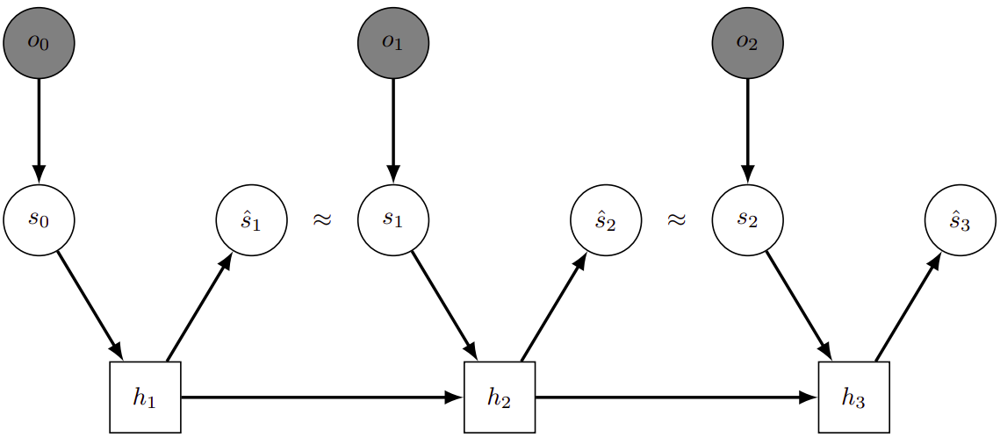

# Temporal Predictive Coding For Model-Based Planning In Latent Space

This is an implementation of the paper [Temporal Predictive Coding For Model-Based Planning In Latent Space](https://arxiv.org/abs/2106.07156) in Tensorflow 2 . We propose TPC - an information-theoretic representation learning framework for reinforcement learning from high-dimensional observations. TPC employs temporal predictive coding to encode elements in the environment that can be predicted across time, and learns this representation in conjunction with a recurrent state space model that allows planning in latent space. Experiments show that our model is superior to existing methods in several DMControl tasks.



Details of the model architecture and experimental results can be found in our [following paper](https://arxiv.org/abs/2106.07156):

```
@article{nguyen2021temporal,
  title={Temporal Predictive Coding For Model-Based Planning In Latent Space},
  author={Nguyen, Tung and Shu, Rui and Pham, Tuan and Bui, Hung and Ermon, Stefano},
  journal={arXiv preprint arXiv:2106.07156},
  year={2021}
}
```

**Please CITE** our paper whenever this repository is used to help produce published results or incorporated into other software.

## Installing

First, clone the repository:

```
https://github.com/tung-nd/TPC-tensorflow.git
```

Then install the dependencies as listed in `tpc.yml` and activate the environment:

```
conda env create -f tpc.yml
conda activate tpc
```

## Training

```
python tpc.py --task dmc_cartpole_swingup --logdir ./logdir/standard/cartpole_swingup/TPC/1 --img_source_type none --seed 1
```

The above command will train the TPC agent on cartpole swingup task in the standard setting (i.e., no backgrounds), and the results will be saved in `./logdir/standard/cartpole_swingup/TPC/1`. To run the agent in the natural background setting, first download the source videos, then run by setting `--img_source_type video`. If `--random_bg` is also set to `True`, the background will be randomized for each time step.

### Download background videos

There are two sources of background videos. The first is the `kinetics400` dataset, which can be downloaded by simply running ``python download_videos.py``. The other source is using simplistic random backgrounds, which can be generated by running ``python gen_rain.py``.

### Plotting

Visualize losses and videos of the agent during training:

```
tensorboard --logdir ./logdir/cartpole_swingup/TPC/1 --port 6010
```

Generate plots:

```
python plotting.py --indir ./logdir/standard --outdir ./plots/standard --xaxis step --yaxis test/return --bins 3e4 --cols 3
```
